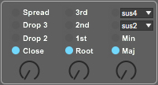

# Chordial MIDI User Guide

Chordial MIDI is made up of four sections:

### The MIDI Input section

The **Trigger Mode** selector chooses between the following two modes of operation:

- Drone: Chordial will sustain the last received MIDI note until you switch back to Key mode. Any incoming
MIDI notes while Drone mode is activated will cause all 4 chord voices to be retriggered relative to the
incoming pitch value. Any parameter changes made while Drone mode is activated will only retrigger those
notes that are affected by the parameter change.

- Key: Chordial tracks incoming MIDI notes as you'd expect. Any parameter changes made while a key is held down
with Key mode activated will only retrigger those notes that are affected by the parameter change.

The **Velocity Mode** selector chooses between the following two modes of operation:

- Key: Chordial tracks incoming velocity as you'd expect. The velocity value received at input is passed along
to all four chord voices.

- Slider: Chordial will ignore any incoming velocity values, and instead apply the value set by the velocity sliders
to each chord voice. This allows you to set a different velocity value for each chord voice every time a new incoming
note is detected.

The sliders below the Velocity Mode selector set the outgoing velocity value for each chord voice when in Slider mode.

### The Voice Toggle section

The voice toggle buttons turn each of the chord voices on and off. If Drone mode is activated, toggling a voice from off to on will cause that note to be retriggered. Likewise, if Key mode is activated and a voice is toggled from off to on, that note will be retriggered.

### The Chord Parameter section

The knob on the left changes between chord voicings.  The knob in the middle changes the inversion of the chord. The knob on the 
right (plus the two drop-down menus) change the chord quality. Just play with these and see what they do!

### The Voice Delay section

Each of the outgoing chord voice MIDI notes can be delayed. This can be useful for creating strums or arpeggios. Click on the
chord voice button at the left of this section (R, 3, 5, 7) to activate the delay for that voice. Each voice delay operates in one of the following two modes:

- ms: a chord voice can be delayed from 0 up to 1000 milliseconds.
- note: a chord voice can be delayed by a musical time interval, from a 64th note through to a full bar, synchronized
to Live's transport. **If note mode is activated, you'll only hear the delayed note if Live's transport is running!**

When a voice delay is activated, any parameter changes that cause that voice to be retriggered will be subject to the voice delay amount. For example, if you set a delay of 1/8th note to the Root voice and then change the Inversion amount, the Root voice will change 1/8th note later.
