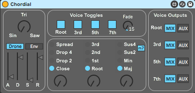
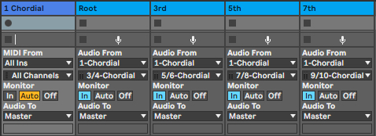

# Chordial
A Max For Live chord oscillator device based on the Chord eurorack module (V1) by Qu-Bit Electronix.

Chordial is a monophonic chord oscillator with four different pitches that are tuned to a variety of chord shapes.  

Features in a nutshell:

- Continuously variable waveshape from sine to triangle to saw.
- Drone mode for...drones. Env mode for traditional monophonic playing.
- 4 different chord voicings: Close, Drop 2, Drop 3, and Spread.
- 4 different chord inversions: Root, 1st, 2nd, 3rd.
- 4 different chord qualities: Major, Minor, Sus2, and Sus4. The m7 button lets you change the 7th in Sus2 and Sus4 mode from minor to major.
- Voice toggles for turning individual chord voices on and off. Also includes a fade control that applies a variable fade-in/fade-out to the toggle.
- A voice output section that lets you route individual voices to their own audio track.

To route a voice to a separate audio track in Live, create a new audio track, set the monitor state to "In" and select "Chordial" in the Audio From chooser. Currently the voices are selected by choosing the following outputs from an instance of Chordial:

- Root: 3/4-Chordial
- 3rd:  5/6-Chordial
- 5th:  7/8-Chordial
- 7th:  9/10-Chordial

Once the routing has been set up, switch the voice output selector on Chordial from Mix to Aux.

Note that assigning a voice to the Aux bus removes it from the Mix bus.

Here's what an instance of Chordial with each voice mapped to an audio track would look like in Live's mixer:

