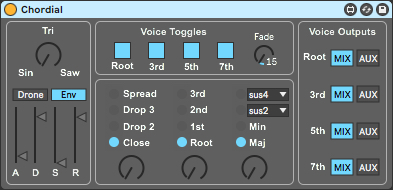
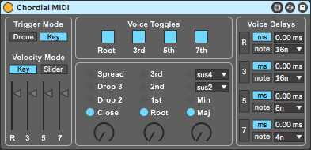

# Chordial
A set of Max For Live devices based on the Chord eurorack module (V1) by Qu-Bit Electronix.

Chordial is a monophonic chord oscillator with four different pitches that are tuned to a variety of chord shapes.  

Chordial MIDI is a MIDI Effect that outputs four different pitches that are tuned to a variety of chord shapes.

Features in a nutshell:

- Continuously variable waveshape from sine to triangle to saw (Chordial only).
- Drone mode for...drones. Env mode (Chordial)/Key mode (Chordial MIDI) for traditional monophonic playing.
- 4 different chord voicings: Close, Drop 2, Drop 3, and Spread.
- 4 different chord inversions: Root, 1st, 2nd, and 3rd.
- 4 different chord qualities: Major, Minor, and two user selectable qualities (sus2, sus2maj7, sus4, sus4maj7, dominant, half-diminished). 
- Voice toggles for turning individual chord voices on and off. Also includes a fade control (Chordial only) that applies a variable fade-in/fade-out to the toggle. With Chordial MIDI, a toggle fade is easily handled by the receiving instruments' envelopes.
- A voice output section that lets you route individual voices to their own audio track (Chordial only).
- A simple MIDI delay section that lets you delay each individual chord voice by a set amount, either freely or synchronized to your Live set tempo (Chordial MIDI only).

## How to route the Voice Outputs with Chordial

To route a voice to a separate audio track in Live, create a new audio track, set the monitor state to "In" and select "Chordial" in the Audio From chooser. Currently the voices are selected by choosing the following outputs from an instance of Chordial:

- Root: 3/4-Chordial
- 3rd:  5/6-Chordial
- 5th:  7/8-Chordial
- 7th:  9/10-Chordial

Once the routing has been set up, switch the voice output selector on Chordial from Mix to Aux.

Note that assigning a voice to the Aux bus removes it from the Mix bus.

Here's what an instance of Chordial with each voice mapped to an audio track would look like in Live's mixer:

## How to make sense of Chordial MIDI

### Trigger Mode:

Drone - Chordial will sustain the last received MIDI note until you switch back to Key mode. Any incoming
MIDI notes while Drone mode is activated will cause all 4 chord voices to be retriggered relative to the
incoming pitch value. Any parameter changes made while Drone mode is activated will only retrigger those
notes that are affected by the parameter change.

Key - Chordial tracks incoming MIDI notes as you'd expect. Any parameter changes made while a key is held down
with Key mode activated will only retrigger those notes that are affected by the parameter change.

### Velocity Mode:

Key - Chordial tracks incoming velocity as you'd expect. The velocity value received at input is passed along
to all four chord voices.

Slider - Chordial will ignore any incoming velocity values, and instead apply the value set by the velocity sliders
to each chord voice. This allows you to set a different velocity value for each chord voice every time a new incoming
note is detected.

### Voice Toggles:

Each button turns a chord voice on or off. If Drone mode is activated, toggling a voice from off to on will cause
that note to be retriggered. Likewise, if Key mode is activated and a voice is toggled from off to on, that note
will be retriggered.

### Voice Delays:

Each of the outgoing chord voice MIDI notes can be delayed. This can be useful for creating strums or arpeggios. Click on the
chord voice button to activate the delay for that voice. Each voice delay operates in one of the following two modes:

ms - a chord voice can be delayed from 0 up to 1000 milliseconds.
note - a chord voice can be delayed by a musical time interval, from a 64th note through to a full bar, synchronized
to Live's transport.

* If note mode is activated, you'll only hear the delayed note if Live's transport is running!
* When a voice delay is activated, any parameter changes that cause that voice to be retriggered will be
  subject to the voice delay amount. For example, if you set a delay of 1/8th note to the Root voice and then
  change the Inversion amount, the Root voice will change 1/8th note later.
