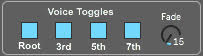

# Chordial User Guide

To install Chordial, copy the file "Chordial.amxd" to wherever you like to keep your Max For Live instrument devices. You must also copy the JavaScript file "ChordialShapes.js" to this directory (or add it to your Max search path) or the device will not work properly.

Chordial is made up of four sections:

### The Oscillator section

The waveform knob at the top continuously fades from sine to triangle to sawtooth waveforms. The square wave is missing because 
I'm not smart enough figure out how to fade nicely from saw to square without losing the fundamental. I couldn't get it to sound
right and I have better things to do than settle an argument between a sawtooth wave and square wave. Sorry about that.

The Drone/Env selector buttons in the middle change between drone mode and envelope mode. Drone mode will make Chordial drone 
continuously. Envelope mode applies the envelope to the output of the oscillator.

The ADSR controls at the bottom adjust the parameters of the envelope used by Envelope mode.

### The Voice Toggle section

The voice toggle buttons turn each of the chord voices on and off. The fade knob applies a fade (both in and out) to the toggle.

### The Chord Parameter section

The knob on the left changes between chord voicings.  The knob in the middle changes the inversion of the chord. The knob on the 
right (plus the two drop-down menus) change the chord quality. Just play with these and see what they do!

### The Voice Output section

These controls allow you to route the audio signal generated by each chord voice to its own audio track in your Live set.

To route a voice to a separate audio track in Live, create a new audio track, set the monitor state to "In" and select "Chordial" in the Audio From chooser. Currently the voices are selected by choosing the following outputs from an instance of Chordial:

- Root: 3/4-Chordial
- 3rd:  5/6-Chordial
- 5th:  7/8-Chordial
- 7th:  9/10-Chordial

Once the routing has been set up, switch the voice output selector on Chordial from Mix to Aux.

Note that assigning a voice to the Aux bus removes it from the Mix bus.

Here's what an instance of Chordial with each voice mapped to an audio track would look like in Live's mixer:

